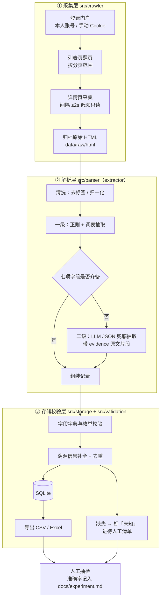

# 门户就业信息结构化采集与抽取实验

> 软件工程课程作业项目（Course Project of Software Engineering）

## 一、项目背景与目标

本校就业信息门户的「就业信息」栏目长期发布毕业生就业分享文章。这些文章是**非结构化长文本**，
信息散落在标题与正文段落里，人工汇总成本高、口径不统一，也难以做跨届次的对比分析。

本实验的目标是：从门户「就业信息」栏目采集就业分享文章，结构化抽取
**届别、年级、学历、专业、城市、单位、岗位**七项核心字段，并保证**每条记录可溯源**
——任意一条结果都能回溯到「列表页 → 详情页 → 归档原始 HTML → 命中原文片段」。

具体目标与验收标准：

| 编号 | 目标 | 验收标准 |
| ---- | ---- | -------- |
| G1 | 登录后可稳定采集「就业信息」栏目文章 | 覆盖指定分页范围，列表页与详情页均可重复采集 |
| G2 | 七项核心字段结构化输出 | 每条记录含 `届别/年级/学历/专业/城市/单位/岗位` 七个字段 |
| G3 | 规则优先、LLM 兜底的两级抽取 | 规则命中率与 LLM 兜底占比可统计、可解释 |
| G4 | 每条记录可溯源 | 含来源 URL、归档 HTML 路径、抽取方式与命中片段 |
| G5 | 人工抽检闭环 | 抽样复核，缺失值统一标「未知」并进入待人工清单 |

## 二、总体技术路线

**规则优先 + LLM 兜底 + 人工抽检**，管线分三层：



| 环节 | 做什么 | 对应目录 |
| ---- | ------ | -------- |
| 采集 | 登录、翻页、拉取详情页、归档 HTML | `src/crawler/` |
| 解析 | 清洗 → 一级规则抽取 → 二级 LLM 兜底 | `src/parser/`（extractor） |
| 存储校验 | 校验、去重、入库、导出、待人工清单 | `src/storage/`、`src/validation/` |
| 编排 | 三段式 stage 调度与断点续跑 | `src/pipeline/` |

## 三、目录结构

> ✅ = 已建立（空文件占位）　⏳ = 待建立

```
software-work/
├── README.md                 ✅ 本文件
├── requirements.txt          ✅ 依赖清单
├── .env.example              ✅ 环境变量模板（密钥/密码走这里，不进版本库）
├── .gitignore                ✅ 忽略 .env、data 产物、缓存
│
├── config/                   ← 配置块
│   ├── config.yaml           ⏳ 主配置：门户 BASE、登录方式、间隔、分页范围、LLM/OCR 开关
│   ├── settings.yaml         ✅ 既有：路径 / 采集 / 解析 / 校验 / 存储 / 日志
│   ├── fields.yaml           ✅ 字段口径：字段名、类型、必填、归一化
│   └── aliases.yaml          ✅ 别名归一化词表：城市 / 学历 / 届别 / 单位后缀
│
├── scripts/                  ⏳ 辅助脚本块：抽检抽样、待人工清单整理、导出核对
│
├── data/                     ← 数据块
│   ├── raw/
│   │   ├── html/             ✅ 归档原始 HTML（溯源的底座）
│   │   └── images/           ✅ 图片型分享的附件
│   ├── processed/
│   │   ├── jobs.csv          ✅ 结构化结果
│   │   ├── jobs.xlsx         ✅ 交付/汇报用表
│   │   └── manual_review.csv ⏳ 缺失字段待人工清单
│   └── employment.db         ✅ SQLite 库
│
├── src/
│   ├── crawler/              ← 采集层（crawler 块）
│   │   ├── session.py        ✅ 会话：UA、Cookie、限速、重试
│   │   ├── list_page.py      ✅ 列表页采集与翻页
│   │   ├── detail_page.py    ✅ 详情页采集
│   │   ├── crawler.py        ✅ 采集调度入口
│   │   └── login_check.py    ⏳ 登录自检：确认会话有效后再开跑
│   ├── parser/               ← 解析层（extractor 块）
│   │   ├── cleaner.py        ✅ 去标签、全角转半角、空白折叠
│   │   ├── rules.py          ✅ 一级抽取：正则 + 词表
│   │   ├── llm.py            ✅ 二级抽取：LLM JSON 兜底
│   │   ├── extractor.py      ✅ 两级抽取组装与字段归一
│   │   └── ocr.py            ✅ 图片型分享的 OCR
│   ├── storage/              ← 存储层（storage 块）
│   │   ├── database.py       ✅ 连接、建表、批量写入、导出
│   │   └── models.py         ✅ 数据模型（含溯源字段）
│   ├── validation/           ✅ 校验：必填/枚举/区间、去重、待人工清单
│   ├── pipeline/
│   │   ├── pipeline.py       ✅ 端到端编排
│   │   └── run.py            ⏳ 命令行入口：--stage fetch / extract / export
│   └── main.py               ✅ 备用总入口
│
├── tests/                    ✅ 清洗、规则、抽取、入库 单元测试
│   ├── test_cleaner.py  test_rules.py  test_parser.py  test_database.py
│
└── docs/                     ✅ 交付文档块
    ├── architecture.md       架构与模块设计
    ├── experiment.md         实验设计、抽检准确率与结论
    └── screenshots/          运行截图
```

## 四、环境依赖

**Python ≥ 3.9**

| 依赖 | 必选/可选 | 用途 |
| ---- | --------- | ---- |
| `requests` | 必选 | 登录态会话与页面请求 |
| `beautifulsoup4` | 必选 | HTML 解析与正文定位 |
| `lxml` | 推荐 | 更快的解析后端 |
| `pandas` | 必选 | 结果整理、CSV / Excel 导出与抽检 |
| `openpyxl` | 必选 | `.xlsx` 写出 |
| `PyYAML` / `python-dotenv` | 必选 | 读 `config.yaml` 与 `.env` |
| `playwright` | 可选 | 门户需要 JS 渲染或需自动触发登录时使用 |
| `openai` | 可选 | LLM 兜底（走 OpenAI 兼容接口） |
| `ollama` | 可选 | LLM 兜底（本地模型，替代上者，二选一） |
| `pytesseract` + `Pillow` | 可选 | 图片型分享的 OCR |
| `pytest` / `pytest-cov` | 推荐 | 单元测试与覆盖率 |

可选依赖缺失时，对应开关在 `config.yaml` 中置为关闭，管线走降级路径（跳过二级抽取或跳过 OCR）。

## 五、配置说明（`config/config.yaml` 要填什么）

> 本节只说明**要填哪些项**，不含任何账号口令示例；真实密码/Key 一律放 `.env`，`.env` 已在 `.gitignore` 中。

| 配置项 | 要填什么 | 注意 |
| ------ | -------- | ---- |
| `portal.base_url` | 门户 BASE 地址（就业信息栏目根） | 只填本校门户地址 |
| `portal.list_url` | 列表页地址或 URL 模板 | 含页码占位符 |
| `portal.page_param` | 页码参数名 | 按门户实际参数名填写 |
| `portal.page_start` / `portal.page_end` | 分页范围 | 先小范围试跑，确认无误再放大 |
| `auth.method` | 登录方式：账号登录 / 手动 Cookie | 二选一 |
| `auth.student_id` | 本人学号 | 从 `.env` 读取，不写进 yaml |
| `auth.password` | 本人密码 | **仅放 `.env`**，不提交、不外传 |
| `auth.cookie` | 手动从浏览器复制的 Cookie | 仅在 `auth.method=cookie` 时填，本质等同于登录态凭据 |
| `auth.session_file` | 会话/StorageState 保存路径 | 实验结束后删除该文件 |
| `request.interval_seconds` | 请求间隔，**≥ 2** | 红线项，不得调小 |
| `request.timeout` / `request.retries` | 单请求超时与重试次数 | 失败重试同样计入间隔 |
| `request.user_agent` | 请求头 UA | 用常规浏览器 UA |
| `request.use_playwright` | 是否启用 playwright | 默认关闭 |
| `extract.rule_first` | 是否规则优先 | 固定为开启 |
| `extract.missing_placeholder` | 缺失值占位符 | 填「未知」 |
| `extract.manual_review_output` | 待人工清单输出路径 | 默认 `data/processed/manual_review.csv` |
| `extract.regex_file` / `extract.lexicon_file` | 正则与词表所在文件 | 指向 `config/` 下的规则文件 |
| `llm.enabled` | LLM 兜底开关 | 关闭时缺失字段直接标「未知」 |
| `llm.provider` | `openai` 或 `ollama` | 二选一 |
| `llm.base_url` | LLM 接口地址 | 自行配置 |
| `llm.model` | 模型名 | 自行选择 |
| `llm.api_key` | 接口 Key | **只放 `.env`** |
| `llm.timeout` / `llm.max_retries` | 超时与重试 | 避免长尾请求挂死 |
| `ocr.enabled` | OCR 开关 | 默认关闭 |
| `ocr.lang` | OCR 语言包 | 如 `chi_sim+eng` |
| `ocr.tesseract_cmd` | tesseract 可执行路径 | 视本机安装位置填写 |
| `storage.db_path` | SQLite 路径 | 默认 `data/employment.db` |
| `output.csv_path` / `output.xlsx_path` | 导出路径 | 默认在 `data/processed/` |
| `sampling.review_rate` | 人工抽检比例 | 建议 5%–10% |

优先级：**`.env` 环境变量 > `config.yaml` > 代码默认值**。

## 六、运行步骤（命令骨架）

```bash
pip install -r requirements.txt

# （可选）门户需要 JS 渲染或自动登录时
playwright install

# 登录自检：先确认会话有效，再开始采集
python -m src.crawler.login_check

# ① 采集：列表页 → 详情页 → 归档原始 HTML
python -m src.pipeline.run --stage fetch

# ② 解析：清洗 → 一级规则抽取 → 二级 LLM 兜底
python -m src.pipeline.run --stage extract

# ③ 存储校验：校验去重 → 入库 → 导出 CSV/Excel + 待人工清单
python -m src.pipeline.run --stage export

# 测试
pytest -v
```

> 以上为命令骨架，详细参数（分页范围、开关覆写、断点续跑等）在实现时补充。
> 当前 `src/` 下多为空占位文件，因此这些命令**尚未可执行**，见第九节。

## 七、字段口径与两级抽取

### 7.1 七项核心字段

| 字段 | 中文 | 来源位置 | 一级：规则（正则 / 词表） | 二级：LLM JSON 兜底 |
| ---- | ---- | -------- | ------------------------ | ------------------- |
| `graduation_year` | 届别 | 标题、正文首段 | 正则 `(\d{4})\s*届` + 届别词表 | 规则未命中或格式异常时兜底 |
| `grade` | 年级 | 正文 | 年级词表（大一…大四 / 研一…研三 / 应届） | 规则未命中时兜底 |
| `degree` | 学历 | 正文、作者信息 | 学历词表（专科 / 本科 / 硕士 / 博士） | 同一段落出现多种表述时兜底判定 |
| `major` | 专业 | 标题、正文 | 本校专业目录词表 + 别名归一 | **主要靠 LLM**：长尾专业、跨专业表述 |
| `city` | 城市 | 正文（签约去向） | 城市词表 + 别名归一（如「京」→ 北京） | 复合地点（如「XX 市 XX 区」）兜底解析 |
| `employer` | 单位 | 正文（签约去向） | 后缀词表（公司/集团/银行/局/院/所/学校）+ 就近匹配 | **主要靠 LLM**：单位全称、简称混用 |
| `position` | 岗位 | 正文 | 岗位关键词表（工程师/经理/教师/…） | **主要靠 LLM**：岗位描述性表述 |

### 7.2 溯源字段（每条必带）

| 字段 | 说明 |
| ---- | ---- |
| `source_url` | 详情页 URL |
| `list_url` | 来源列表页 URL（含页码） |
| `raw_html_path` | `data/raw/html/` 下的归档文件路径 |
| `crawl_time` | 采集时间 |
| `extract_method` | 该条记录的抽取方式：`rule` / `llm` / `hybrid` |
| `evidence` | 命中片段：规则命中的原句，或 LLM 给出依据的原文片段 |
| `review_status` | 是否已人工抽检、复核结论 |

### 7.3 两级抽取的判定与降级

- **一级（规则优先）**：先跑正则与词表，命中即采信，速度快、可解释、零成本。
- **二级（LLM 兜底）**：七项字段未齐备时，把清洗后的正文交给 LLM，要求**按固定 key 返回 JSON**，
  并要求同时给出 `evidence` 原文片段；返回无法解析为 JSON 时按抽取失败处理。
- **缺失处理**：两级都拿不到的字段统一填 **「未知」**，且该记录写入
  `data/processed/manual_review.csv` 待人工清单，由本人手工补全。
- **人工抽检**：按 `sampling.review_rate`（建议 5%–10%）随机抽样，逐条比对原文，
  把字段准确率与主要错误类型记入 `docs/experiment.md`。

## 八、合规与红线

1. **本人账号登录**：仅使用本人学号账号访问，不借用、不共享、不代他人采集。
2. **只读低频**：只做只读访问，不提交任何表单/写操作；请求间隔 **≥ 2 秒**，不做并发压测式抓取。
3. **不公开不外传**：采集数据与登录态仅本地留存，不公开发布、不向第三方传播、不用于任何商业用途。
4. **实验结束清会话**：删除本地 Cookie / StorageState 会话文件与 `.env` 中的凭据，清理不必要的原始缓存。
5. **图片 OCR 人工复核**：OCR 抽取结果一律视为待校验，必须人工复核后才能进入最终数据集。

## 九、AI 使用情况声明

本实验方法通过与 AI 讨论得出；初始想法为向量检索，后采用规则+LLM 混合路线；本报告与文档统一使用 AI 辅助润色和调整，核心登录/选择器/正则由本人按本校门户实际结构补齐。

## 十、待办 / 本人需手写部分

| # | 事项 | 说明 |
| - | ---- | ---- |
| 1 | **登录参数与选择器按实际门户调整** | `portal.base_url`、列表页与详情页的 DOM 选择器、登录表单字段名，需按本校门户真实结构逐项补齐 |
| 2 | **正则词表白名单人工确认** | 届别/学历/专业/城市/单位后缀等词表由本人核对，剔除误召项、补全本校常用表述 |
| 3 | **LLM 接口地址与 Key 自行配置** | `llm.base_url` / `llm.model` / `llm.api_key` 自行填写（OpenAI 兼容接口或本地 ollama） |
| 4 | 分页范围与试跑 | 先小范围试跑验证解析正确，再扩大 `page_start`–`page_end` |
| 5 | 是否启用 playwright 自行判定 | 取决于门户是否 JS 渲染、能否脚本化登录 |
| 6 | OCR 结果人工复核 | 图片型分享的识别结果逐条复核后再入库 |
| 7 | 抽检与结论 | 抽样复核，字段准确率写入 `docs/experiment.md` |
| 8 | 配置与依赖收口 | 新建 `config/config.yaml` 并与既有 `settings.yaml` 合并；`requirements.txt` 与第四节依赖清单对齐（当前含 selenium/SQLAlchemy，需改为 playwright 等） |
| 9 | 代码实现 | `src/` 与 `tests/` 下现有文件为空占位，需按第三节结构逐一实现（`scripts/`、`login_check.py`、`run.py` 待新建） |

## 十一、交付物

| 交付物 | 路径 |
| ------ | ---- |
| 结构化数据集 | `data/processed/jobs.csv`、`data/processed/jobs.xlsx` |
| 待人工清单 | `data/processed/manual_review.csv` |
| 数据库 | `data/employment.db` |
| 架构与设计 | `docs/architecture.md` |
| 实验与抽检结论 | `docs/experiment.md` |
| 运行截图 | `docs/screenshots/` |

## 十二、许可

本项目仅用于课程学习与教学目的。
