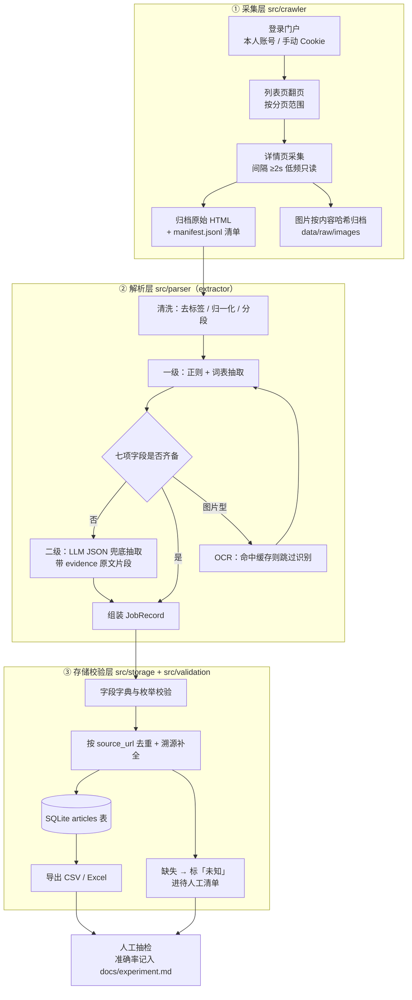

# 门户就业信息结构化采集与抽取实验

> 软件工程课程作业项目（Course Project of Software Engineering）
>
> 📖 **第一次接触本项目？先读 [`docs/overview.md`](docs/overview.md)（项目导读，10 分钟看懂）。**

## 一、项目背景与目标

本校就业信息门户的「就业信息」栏目长期发布毕业生就业分享文章。这些文章是**非结构化长文本**，
信息散落在标题与正文段落里，人工汇总成本高、口径不统一，也难以做跨届次的对比分析。

本实验的目标是：从门户「就业信息」栏目采集就业分享文章，结构化抽取
**届别、年级、学历、专业、城市、单位、岗位**七项核心字段，并保证**每条记录可溯源**
——任意一条结果都能回溯到「列表页 → 详情页 → 归档原始 HTML → 命中原文片段」。

具体目标与验收标准：

| 编号 | 目标 | 验收标准 | 当前状态 |
| ---- | ---- | -------- | -------- |
| G1 | 登录后可稳定采集「就业信息」栏目文章 | 覆盖指定分页范围，列表页与详情页均可重复采集 | ⏳ 待真实门户参数 |
| G2 | 七项核心字段结构化输出 | 每条记录含 `届别/年级/学历/专业/城市/单位/岗位` | ✅ 合成样本文字型 7/7 |
| G3 | 规则优先、LLM 兜底的两级抽取 | 规则命中率与 LLM 兜底占比可统计、可解释 | ✅ 口径与统计已验证（LLM 未实跑） |
| G4 | 每条记录可溯源 | 含来源 URL、归档 HTML 路径、抽取方式与命中片段 | ✅ 已实现并有测试 |
| G5 | 人工抽检闭环 | 抽样复核，缺失值统一标「未知」并进入待人工清单 | ✅ 固定种子抽样 + 清单产出 |

## 二、总体技术路线

**规则优先 + LLM 兜底 + 人工抽检**，管线分三层：



| 环节 | 做什么 | 对应目录 |
| ---- | ------ | -------- |
| 采集 | 登录、翻页、拉取详情页、归档 HTML 与图片、写清单 | `src/crawler/` |
| 解析 | 清洗 → 一级规则抽取 → 二级 LLM 兜底 → 可选 OCR | `src/parser/`（extractor） |
| 存储校验 | 校验、去重、入库、导出、待人工清单 | `src/storage/`、`src/validation/` |
| 编排 | 三段式 stage 调度与断点续跑 | `src/pipeline/` |

## 三、目录结构

> ✅ = 已实现并通过测试　⏳ = 待真实门户参数/凭据后才能完成的校准

```
software-work/
├── README.md                 ✅ 本文件
├── requirements.txt          ✅ 依赖清单（Python ≥ 3.9）
├── .env.example              ✅ 环境变量模板（凭据只放 .env，不进版本库）
├── .gitignore                ✅ 忽略 .env、.venv、data 产物、缓存
├── .venv/                    ✅ 本地虚拟环境（已装 pytest/pandas/bs4，已被 gitignore）
│
├── config/                   ← 配置块
│   ├── config.yaml           ✅ 主配置：门户 BASE、登录方式、间隔、分页、LLM/OCR 开关
│   ├── fields.yaml           ✅ 字段口径：列序 / 中文名 / 必填 / 归一化（18 列）
│   ├── aliases.yaml          ✅ 词表：届别 / 年级 / 学历 / 专业 / 城市 / 单位后缀 / 岗位
│   └── settings.yaml         ⚠️ 旧版配置（已被 config.yaml 取代，可删除）
│
├── scripts/
│   ├── bench_storage.py      ✅ 存储方案基准测试（为 docs/storage-decision.md 出实测数据）
│   └── probe_portal.py       ✅ 门户可达性探测（只读、不登录；门户改版时重跑）
│
├── data/                     ← 数据块
│   ├── raw/
│   │   ├── html/             ✅ 原始 HTML 归档（按 sha1(detail_url) 命名）
│   │   ├── images/           ✅ 图片归档（按 <article_key>/<image_sha1> 命名）
│   │   ├── ocr/              ✅ OCR 结果缓存（按图片内容哈希命名，命中即跳过识别）
│   │   └── manifest.jsonl    ✅ 采集清单：URL ↔ 归档文件 映射（sha1 不可逆，必须显式记录）
│   ├── processed/
│   │   ├── jobs.csv          ✅ 结构化结果（18 列）
│   │   ├── jobs.xlsx         ✅ 交付/汇报用表
│   │   ├── manual_review.csv ✅ 缺失字段待人工清单
│   │   └── summary.json      ✅ 完整率与分布统计
│   └── employment.db         ✅ SQLite 库
│
├── src/
│   ├── contracts.py          ✅ 契约层：DTO + Protocol + 幂等键（仅标准库）
│   ├── config.py             ✅ 配置层：config.yaml + .env → 强类型 AppConfig + 启动校验 + 词表注入
│   ├── crawler/              ← 采集层（crawler 块）
│   │   ├── session.py        ✅ 会话：限速 ≥2s、重试、UA/Cookie、可选 playwright
│   │   ├── list_page.py      ✅ 列表页：URL 拼接 + 纯函数解析（选择器 ⏳ 待核对）
│   │   ├── detail_page.py    ✅ 详情页：抓取 + 归档 + 清单 + 图片 URL 抽取
│   │   ├── crawler.py        ✅ 采集门面：实现 PageFetcher（含门面再导出）
│   │   └── login_check.py    ✅ 登录自检 / 清会话（命令行入口）
│   ├── parser/               ← 解析层（extractor 块）
│   │   ├── cleaner.py        ✅ 去标签、全角转半角、分段
│   │   ├── rules.py          ✅ 一级抽取：正则 + 词表（词表 ⏳ 待人工确认）
│   │   ├── llm.py            ✅ 二级抽取：提示词 + 严格 JSON 解析 + 证据校验
│   │   ├── extractor.py      ✅ 抽取门面：实现 ArticleExtractor（两级组装）
│   │   └── ocr.py            ✅ 图片 OCR + 内容寻址缓存
│   ├── storage/              ← 存储层（storage 块）
│   │   ├── models.py         ✅ 表结构 + 行映射（标准库 sqlite3，无 ORM）
│   │   └── database.py       ✅ 存储门面：实现 RecordRepository
│   ├── validation/           ✅ 校验（必填/格式/区间/未知/OCR 复核）+ 统计 + 可复现抽检
│   ├── pipeline/
│   │   ├── pipeline.py       ✅ 三段式编排（唯一装配点，可注入假门户做离线测试）
│   │   └── run.py            ✅ 命令行入口：--stage fetch/extract/export
│   ├── search/               ← 检索层（零新增依赖：FTS5 + http.server 都是标准库/内建）
│   │   ├── index.py          ✅ L3：FTS5 索引与检索（external-content，不复制正文）
│   │   ├── cache.py          ✅ L1 进程内 LRU + L2 查询缓存（键含数据版本号）
│   │   ├── service.py        ✅ L1→L2→L3 编排 + 关联词 + 采集建议（三道闸门）
│   │   ├── fetcher.py        ✅ 定向采集：门户 searchValue 服务端检索 + 标题兜底过滤
│   │   ├── server.py         ✅ Web 层：只监听 127.0.0.1 的 JSON API + 静态页面
│   │   └── web/              ✅ 前端：index.html / style.css / app.js（原生 JS，零构建）
│   └── main.py               ✅ 备用总入口（转交 CLI）
│
├── tests/
│   ├── conftest.py           ✅ 共享夹具（含内存版假门户 FakeTransport）
│   ├── fixtures/             ✅ 样本：列表页 / 文字型详情页 / 图片型详情页 / 门户通知详情页
│   ├── test_contracts.py     ✅ 接口契约测试（86 项）
│   ├── test_cleaner.py       ✅ 清洗与分段
│   ├── test_rules.py         ✅ 一级规则抽取（含"不编造"断言）
│   ├── test_parser.py        ✅ 两级组装 + LLM 证据校验 + OCR 缓存
│   ├── test_crawler.py       ✅ 采集层（URL/解析/归档/清单/翻页/登录自检）
│   ├── test_database.py      ✅ 存储层（幂等/去重/导出/待人工清单）
│   ├── test_validation.py    ✅ 校验与统计
│   ├── test_portal_api.py    ✅ 接口（JSON）模式列表采集（实测门户配置）
│   ├── test_http_transport.py ✅ 传输层本地集成测试（127.0.0.1 真实 HTTP 往返）
│   ├── test_pipeline.py      ✅ 编排层（三阶段端到端、幂等、CLI 退出码）
│   └── test_search.py        ✅ 检索层（FTS/分词/三级缓存/采集闸门，42 项）
│
└── docs/
    ├── overview.md           ✅ 项目导读（新人解释文稿）
    ├── architecture.md       ✅ 模块接口与契约（接口的权威说明）
    ├── implementation-plan.md ✅ 实施计划（排期、验收门与分工）
    ├── storage-decision.md   ✅ 存储与缓存方案分析（实测数据 + 推荐方案）
    ├── portal-probe.md       ✅ 门户可达性探测报告（实测结论 + 待核对清单）
    ├── experiment.md         ✅ 实验报告（已实测结果 + 待补实验）
    └── screenshots/          运行截图
```

> 各 Python 包内含 `__init__.py`（未在树中逐一列出）。

## 四、环境依赖

**Python ≥ 3.9**

| 依赖 | 必选/可选 | 用途 |
| ---- | --------- | ---- |
| `requests` | 必选 | 登录态会话与页面请求 |
| `beautifulsoup4` | 必选 | HTML 解析与正文定位 |
| `lxml` | 必选 | 更快的解析后端 |
| `pandas` | 必选 | 结果整理、CSV / Excel 导出与抽检 |
| `openpyxl` | 必选 | `.xlsx` 写出 |
| `PyYAML` / `python-dotenv` | 必选 | 读 `config.yaml` 与 `.env` |
| `pytest` / `pytest-cov` | 必选 | 单元测试与契约测试 |
| `playwright` | 可选 | 门户需要 JS 渲染或脚本化登录时使用 |
| `openai` | 可选 | LLM 兜底（OpenAI 兼容接口） |
| `ollama` | 可选 | LLM 兜底（本地模型，与上者二选一） |
| `pytesseract` + `Pillow` | 可选 | 图片型分享的 OCR |

存储使用**标准库 sqlite3**，因此不需要 ORM 依赖。可选依赖缺失时，
在 `config/config.yaml` 中关闭对应开关即可，管线会走降级路径
（LLM 关闭 → 保持「未知」；OCR 关闭 → 图片型文章进人工清单；pandas 缺失 → 只出 CSV）。

## 五、配置说明（`config/config.yaml` 要填什么）

> 本节只说明**要填哪些项**，不含任何账号口令。真实密码 / Cookie / API Key 一律放 `.env`
> （`.env` 已在 `.gitignore` 中，且日志输出经 `AppConfig.redacted()` 打码）。
>
> 🔎 门户相关项已按**实测结果**填入（`https://my.muc.edu.cn`，未登录会被 302 到
> `ca.muc.edu.cn/zfca/login`，登录页使用 sm2 前端加密 → `use_playwright: true`）。
> 实测过程与剩余「待核对」清单见 **`docs/portal-probe.md`**。

| 配置项 | 要填什么 | 注意 |
| ------ | -------- | ---- |
| `portal.base_url` | 门户 BASE 地址（就业信息栏目根） | 只填本校门户地址 |
| `portal.list_url` | 列表页地址或带 `{page}` 的模板 | 按门户实际结构 |
| `portal.page_param` | 翻页参数名 | 如 `page` / `p` / `currentPage` |
| `portal.page_start` / `page_end` | 分页范围 | 先小范围试跑，确认无误再放大 |
| `portal.mode` | `api`（POST JSON 接口）或 `html`（解析 DOM） | 实测本校门户是 `api` |
| `portal.api_url` | 列表接口地址 | 实测 `…/comsys-portal-notice-web/getNoticeByPage` |
| `portal.api_page_field` / `api_token_field` | 页码字段 / 随机令牌字段 | 实测 `currentPage` / `comsys_random_t` |
| `portal.api_body` | 请求体模板（页码、令牌、`start`/`end` 由程序注入） | 已按实测填写（`pageSize: 15`、`type: "10"` 等） |
| `portal.api_token_style` | 令牌格式：`js_random`（＝`Math.random()`）或 `hex32` | 实测是 `js_random`，形如 `0.9887865334032206` |
| `portal.api_list_path` / `api_total_path` / `api_total_pages_path` | 列表数组 / 总数 / 总页数的路径 | 实测 `tables`；`page.total`=1040、`page.totalCounts`=70 |
| `portal.api_title_field` / `api_date_field` | 列表项标题 / 时间字段名 | 实测 `notice_title` / `notice_release_time` |
| `portal.api_link_field` / `api_link_state_field` / `api_link_state_external` | 站外链接字段与判定值 | 实测 `notice_link` / `notice_link_state=1` |
| `portal.external_link_policy` | 站外通知策略：`fetch` / `portal` / `skip` | 实测就业信息大量指向微信公众号、腾讯文档，默认 `fetch` |
| `portal.detail_org_id` | 组织 ID 兜底（列表项不带时用） | 实测 `bks1044104407202525rg2` |
| `portal.page_end` | 末页；**`0` = 自动翻到最后一页** | 实测共 1040 条 / 每页 15 条 ≈ 70 页 |
| `portal.detail_url_template` | 详情链接模板（占位取自接口字段） | 实测 `…/page/11#/print?notice_id={notice_id}&show_type=1&type=10`（不需要 `organization_id`） |
| `portal.detail_link_selector` | 仅 `html` 模式用：详情链接的 CSS 选择器 | 不填则退化为「所有链接」 |
| `portal.login_url` / `login_check_url` | 登录页 / 登录态探测页 | 探测页建议用列表页第一页 |
| `auth.method` | `account`（学号密码）或 `cookie`（手动 Cookie） | 二选一 |
| `auth.session_file` | 会话（StorageState）落盘路径 | **实验结束必须删除** |
| — | `.env: AUTH_STUDENT_ID` | 本人学号，不放 yaml |
| — | `.env: AUTH_PASSWORD` | 本人密码，**只放 .env、不提交、不外传** |
| — | `.env: AUTH_COOKIE` | `auth.method=cookie` 时填，本质等同登录态凭据 |
| `request.interval_seconds` | 请求间隔，**≥ 2** | 合规红线，配置校验会直接报错 |
| `request.timeout` / `retries` | 超时与重试次数 | 重试同样计入间隔 |
| `request.user_agent` | 请求头 UA | 用常规浏览器 UA |
| `request.use_playwright` | 是否启用 playwright | 账号登录方式**必须**开启 |
| — | `.env: CRAWLER_PROXY` | 需要代理时填，留空表示直连 |
| `extract.rule_first` | 必须为 `true` | 规则优先的路线不允许关闭 |
| `extract.missing_placeholder` | 必须为「未知」 | 契约强制 |
| `extract.raw_html_dir` | 归档目录 | 清单文件在其父目录 |
| `extract.ocr_images_dir` / `ocr_cache_dir` | 图片归档目录 / OCR 缓存目录 | 缓存按图片内容哈希命名 |
| `extract.manual_review_output` | 待人工清单输出路径 | 默认 `data/processed/manual_review.csv` |
| `extract.regex_file` / `lexicon_file` | 站点正则文件 / 词表文件 | 词表默认 `config/aliases.yaml`（配置层读一次后注入） |
| `extract.llm_trigger_below` | 规则命中数低于该值时触发兜底 | `7` 表示缺任一字段即兜底 |
| `llm.enabled` | LLM 兜底开关 | 关闭时缺失字段直接标「未知」 |
| `llm.provider` | `openai` 或 `ollama` | 二选一 |
| `llm.base_url` / `llm.model` | 接口地址 / 模型名 | 自行填写 |
| — | `.env: LLM_API_KEY` | 接口 Key，**只放 .env** |
| `ocr.enabled` / `ocr.lang` | OCR 开关 / 语言包 | 默认关闭、`chi_sim+eng` |
| — | `.env: TESSERACT_CMD` | tesseract 可执行路径，留空用 PATH |
| `storage.db_path` / `batch_size` | 数据库路径 / 批量提交条数 | — |
| `output.csv_path` / `xlsx_path` | 导出路径 | 默认在 `data/processed/` |
| `sampling.review_rate` / `seed` | 人工抽检比例 / 随机种子 | 建议 5%–10%，种子保证可复现 |

**配置校验红线**（`load_config` 阶段直接失败）：间隔 < 2 秒、`base_url` / `list_url` 非 http(s)、
分页范围倒置、`auth.method` 非法、`rule_first` 被关闭、占位符被改、
LLM 启用但配置不全、抽检比例越界。

优先级：**`.env` 环境变量 > `config/config.yaml` > 代码默认值**。

## 六、运行步骤

```bash
pip install -r requirements.txt

# （可选）门户需要 JS 渲染或自动登录时
playwright install

# 登录自检：先确认会话有效，再开始采集
python -m src.crawler.login_check
python -m src.crawler.login_check --check-config-only   # 只校验配置（离线）

# ① 采集：列表页 → 详情页 → 归档 HTML/图片 + manifest.jsonl
python -m src.pipeline.run --stage fetch

# ② 解析：清洗 → 一级规则抽取 → 二级 LLM 兜底（离线回放归档，不联网）
python -m src.pipeline.run --stage extract

# ③ 存储校验：校验去重 → 入库 → 导出 CSV/Excel + 待人工清单 + 统计摘要
python -m src.pipeline.run --stage export

# 测试（335 项，覆盖率 78%）
pytest -v --cov=src
```

CLI 参数：`--stage`、`--config`、`--page-start`、`--page-end`、`--use-llm`/`--no-llm`、
`--use-ocr`/`--no-ocr`、`--from-cache`、`--json`。
退出码：`0` 成功、`1` 阶段有错误、`2` 参数错误、`3` 配置错误、`4` 登录态无效。

### 6.1 检索服务（把结果变成可交互的查询）

同一份 `data/employment.db` 也可以直接用网页检索（**只监听本机**）：

```bash
# 启动检索服务（默认 http://127.0.0.1:8765/）
python -m src.search.server --open
```

* **类百度页面**：关键词检索 + 七项字段过滤 + 高亮片段 + 关联搜索；
* **三级缓存**：L1 进程内 → L2 查询缓存（跨重启存活）→ L3 SQLite **FTS5** 全文检索；
* **可溯源**：每条结果显示命中依据、字段完整度 n/7，以及"回原文核对"链接；
* **有倾向性采集**：库内命中不足时可发起定向采集，走门户自带的 `searchValue`
  服务端检索（只拉相关的几页）。**默认关闭**（`search.trigger_enabled`），
  开启后仍受冷却时间与预算闸门约束，页面会先显示预估请求数与秒数。
* **零新增依赖**：FTS5 与 `http.server` 都是标准库/内建扩展，`requirements.txt` 未增包。

设计取舍、分词器实测结论与能力边界见 `docs/search.md`。

## 七、字段口径与两级抽取

### 7.1 七项核心字段

| 字段 | 中文 | 来源位置 | 一级：规则（正则 / 词表） | 二级：LLM JSON 兜底 |
| ---- | ---- | -------- | ------------------------ | ------------------- |
| `graduation_year` | 届别 | 标题、正文首段 | 正则 `(\d{4})\s*届` + 届别词表 | 规则未命中或格式异常时兜底 |
| `grade` | 年级 | 正文 | 年级词表（大一…大四 / 研一…研三 / 应届） | 规则未命中时兜底 |
| `degree` | 学历 | 正文、作者信息 | 学历词表（专科 / 本科 / 硕士 / 博士） | 同一段落多种表述时兜底判定 |
| `major` | 专业 | 标题、正文 | 本校专业目录词表 + 别名归一 | **主要靠 LLM**：长尾专业、跨专业表述 |
| `city` | 城市 | 正文（签约去向） | 城市词表 + 别名归一（如「京」→ 北京） | 复合地点兜底解析 |
| `employer` | 单位 | 正文（签约去向） | 后缀词表 + 就近匹配（签约/就职于/入职…）+ 城市前缀剥离 | **主要靠 LLM**：单位全称、简称混用 |
| `position` | 岗位 | 正文（签约去向） | 岗位关键词表 + 线索词匹配 | **主要靠 LLM**：岗位描述性表述 |

词表与正则的数据源：`config/aliases.yaml`（届别 / 年级 / 学历 / 专业 / 城市 /
单位后缀 / 岗位关键词 / 单位触发动词 / 缺失表述）。
**词表在配置阶段读一次并注入 `AppConfig.lexicon`**，解析时零文件 IO。

### 7.2 溯源字段（每条必带）

| 字段 | 说明 |
| ---- | ---- |
| `source_url` | 详情页 URL（数据库唯一键） |
| `list_url` | 来源列表页 URL（含页码） |
| `raw_html_path` | `data/raw/html/` 下的归档文件路径 |
| `crawl_time` | 采集时间 |
| `content_kind` | 内容来源：`html` / `ocr` / `mixed`（OCR 来源强制人工复核） |
| `extract_method` | 该条记录的抽取方式：`rule` / `llm` / `hybrid` |
| `evidence` | 命中片段：规则命中的原句，或 LLM 给出依据的原文片段 |
| `review_status` | 是否已人工抽检、复核结论 |

「详情页 URL ↔ 归档文件名」的对应关系由 `data/raw/manifest.jsonl` 记录
（归档名是 URL 的 sha1，不可逆，必须显式登记才能离线重放）。

### 7.3 两级抽取的判定与降级

- **一级（规则优先）**：先跑正则与词表，命中即采信，速度快、可解释、零成本。
- **二级（LLM 兜底）**：规则命中数 < `llm_trigger_below` 时，把清洗后的正文交给 LLM，
  要求**按固定 key 返回 JSON**，并必须给出 `evidence` 原文片段；
  返回无法解析为 JSON、或 `evidence` 在正文中找不到（疑似幻觉）时**丢弃该字段**。
- **OCR 兜底**：图片型文章（正文很短且带图片）启用 OCR，识别结果走一级规则，
  证据前缀标 `[OCR]`、置信度封顶 0.6，且该记录强制进人工清单。
- **缺失处理**：两级都拿不到的字段统一填 **「未知」**，该记录写入
  `data/processed/manual_review.csv` 待人工清单。
- **人工抽检**：按 `sampling.review_rate`（建议 5%–10%）用固定种子抽样，
  把字段准确率与主要错误类型记入 `docs/experiment.md`。

## 八、模块接口与契约（接口可控）

模块之间的接口不是「靠约定」，而是**可执行、可失败的检查**：

| 保障手段 | 载体 |
| ---- | ---- |
| 数据契约（跨模块只能传 DTO） | `src/contracts.py` |
| 模块「插座」（Protocol） | `contracts.Transport / PageFetcher / ArticleExtractor / RecordValidator / RecordRepository / StageRunner` |
| 依赖方向 + 第三方依赖白名单 | `tests/test_contracts.py` 的 AST 扫描 |
| 配置注入（禁止各模块自己读配置） | 只有 `run.py` 与 `login_check.py` 可调 `load_config` |
| 单一配置读取入口 | `src/config.py::load_yaml / load_lexicon`（其他层不得 import yaml） |
| 校验前置（坏配置启动即失败） | `src/config.py::validate_config` |
| 幂等键与路径规则 | `article_key` / 归档路径 / 清单 / 图片与 OCR 缓存 / `source_url` 唯一键 |
| 计数口径封闭 | `contracts.COUNTER_KEYS`，乱造键直接报错 |
| 异常边界 | 只允许 `PipelineError` 子类跨模块；错误码 `contracts.ErrorCode` |

四条硬性接口规则（违反即契约测试失败）：

1. `parser` 不得 import `storage`/`crawler`，`crawler` 不得 import `parser`/`storage`；
2. 任何层不得 import `pipeline`/`main`（依赖只向下）；
3. `contracts` 只依赖标准库；`yaml` 只允许出现在 `config` 与 `validation`；
4. 除 CLI 入口外任何模块不得自行加载配置。

完整说明（分层图、门面表、DTO 表、错误与降级矩阵、实施期接口补记）见
**`docs/architecture.md`**。契约版本 `SCHEMA_VERSION = 1.1.0`（1.1.0 起图片/OCR 为一等公民）；
改接口必须同步「递增版本 → 改 contracts.py → 改契约测试 → 改文档」四步。

```bash
# 只跑接口契约测试（秒级，不需要网络与门户凭据）
pytest tests/test_contracts.py -v
```

## 九、合规与红线

1. **本人账号登录**：仅使用本人学号账号访问，不借用、不共享、不代他人采集。
2. **只读低频**：只做只读访问，不提交任何表单/写操作；请求间隔 **≥ 2 秒**（含重试间隔），
   不做并发压测式抓取；该值由配置校验强制，**命令行参数也无法绕过**。
3. **不公开不外传**：采集数据与登录态仅本地留存，不公开发布、不向第三方传播、不用于任何商业用途。
4. **实验结束清会话**：删除本地 Cookie / StorageState 会话文件与 `.env` 中的凭据
   （`python -m src.crawler.login_check --clear-session`）。
5. **图片 OCR 人工复核**：OCR 抽取结果一律视为待校验（`content_kind=ocr` 的记录被校验层强制标为待复核）。

## 十、AI 使用情况声明

本实验方法通过与 AI 讨论得出；初始想法为向量检索，后采用规则+LLM 混合路线；本报告与文档统一使用 AI 辅助润色和调整，核心登录/选择器/正则由本人按本校门户实际结构补齐。

## 十一、开发状态与待办

### 11.1 已完成的开发工作

| 阶段 | 内容 | 状态 |
| ---- | ---- | ---- |
| 契约与配置 | `contracts.py`（DTO/Protocol/幂等键）、`config.py`（强类型配置 + 启动校验 + 词表注入） | ✅ |
| 存储层 | `models.py` + `database.py`（幂等 UPSERT、导出、待人工清单、复核回写） | ✅ |
| 校验统计 | `validator.py` + `statistics.py`（判定表、可复现抽检、统计摘要） | ✅ |
| 解析层 | `cleaner` + `rules` + `llm` + `ocr` + `extractor`（两级组装 + 内容寻址 OCR 缓存） | ✅ |
| 采集层 | `session` + `list_page` + `detail_page` + `crawler` + `login_check` | ✅（门户参数待核对） |
| 编排与 CLI | 三阶段 `pipeline` + `run.py` 退出码/覆盖参数 | ✅ |
| 测试 | 335 项用例全绿，语句覆盖率 78% | ✅ |
| 真实门户接入 | 可达性探测（SSO/sm2）契约 1.2.0；**接口模式**（POST JSON）1.3.0；**实测 `tables` 结构 + 站外链接策略** 1.4.0；**实测详情路由 `#/print`** | ✅（`comsys_random_t` 是否被校验、回显字段是否必需 2 项待确认，见 `docs/portal-probe.md` 第九节） |
| 文档 | overview / architecture / implementation-plan / storage-decision / experiment / portal-probe | ✅ |

**端到端验证**（离线，用内存假门户驱动真实代码路径）：`fetch` 抓 3 篇 + 2 张图 →
`extract` 抽 3 条（15 次规则命中、1 条进人工清单）→ `export` 产出
`jobs.csv`（3 行 × 18 列）、`jobs.xlsx`、`manual_review.csv`、`summary.json`。

### 11.2 待办 / 本人需手写部分

| # | 事项 | 说明 |
| - | ---- | ---- |
| 1 | **实跑验证登录与采集** | 接口路径（`tables`）、字段名（`notice_title`/`notice_release_time`）、详情路由（`#/print?notice_id=…`）、令牌（`comsys_random_t` 已确认**不被服务端校验**）均已按实测配好；尚需你填 `.env` 凭据并实跑 `login_check` → `fetch`，验证登录态与站外正文抓取效果 |
| 2 | **正则词表白名单人工确认** | `config/aliases.yaml` 中标了「【本人确认】」的分组（专业、单位后缀、岗位关键词）需人工核对，剔除误召项 |
| 3 | **LLM 接口地址与 Key 自行配置** | `.env` 的 `LLM_BASE_URL` / `LLM_MODEL` / `LLM_API_KEY`，并把 `llm.enabled` 置 true |
| 4 | **OCR 实测与复核** | 安装 tesseract-ocr + 中文语言包，用 5~10 张真实截图替换 `docs/experiment.md` 第六节的估算值 |
| 5 | 是否启用 playwright 自行判定 | 账号登录方式必须开启；否则改用 `auth.method=cookie` |
| 6 | 分页范围与试跑 | 先 1~2 页试跑，确认选择器与解析正确后再放大 |
| 7 | **站外正文的抓取效果实测** | 实测就业信息大量通知指向微信公众号 / 腾讯文档：先用 `external_link_policy: fetch` 试跑，若渲染不全再考虑 `portal`/`skip`（见 `docs/portal-probe.md` 第九节） |
| 8 | 抽检与结论 | 按 `sampling.review_rate` 抽样复核真实数据，准确率写入 `docs/experiment.md` |
| 8 | 清理旧配置 | `config/settings.yaml` 是上一版遗留，确认无用后删除 |
| 9 | 运行截图 | 补 `docs/screenshots/`（真实运行截图） |

## 十二、交付物

| 交付物 | 路径 |
| ------ | ---- |
| 结构化数据集 | `data/processed/jobs.csv`、`data/processed/jobs.xlsx` |
| 待人工清单 | `data/processed/manual_review.csv` |
| 统计摘要 | `data/processed/summary.json` |
| 数据库 | `data/employment.db` |
| 采集清单与归档 | `data/raw/manifest.jsonl`、`data/raw/html/`、`data/raw/images/`、`data/raw/ocr/` |
| 项目导读 | `docs/overview.md` |
| 接口与架构说明 | `docs/architecture.md` |
| 实施计划（排期与验收门） | `docs/implementation-plan.md` |
| 存储与缓存方案分析 | `docs/storage-decision.md` |
| 门户可达性探测报告 | `docs/portal-probe.md` |
| 实验报告（含抽检结论） | `docs/experiment.md` |
| 运行截图 | `docs/screenshots/` |

## 十三、许可

本项目仅用于课程学习与教学目的。
