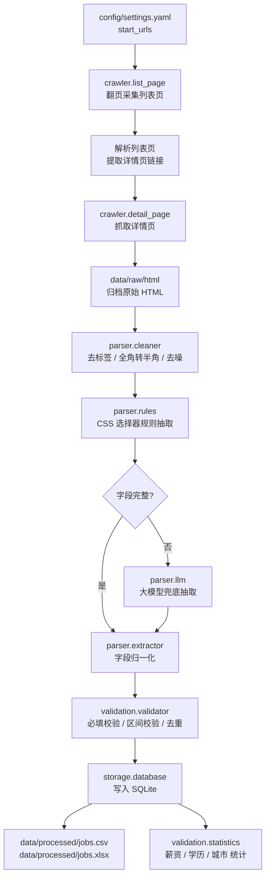

# employment-data-pipeline —— 就业数据采集与分析流水线

> 软件工程课程作业项目（Course Project of Software Engineering）

## 一、项目简介

本项目实现一条**就业/招聘数据采集与分析流水线**，把分散在招聘网站上的职位信息，
经过采集、解析、清洗、校验、去重、入库，最终产出结构化的数据集与统计指标，
为「专业就业形势分析」这类课程实验提供可复现的数据基础。

流水线一句话概括：

```
列表页 → 详情页 → 原始 HTML → 结构化字段 → 校验去重 → SQLite → CSV / Excel → 统计分析
```

与只写一个爬虫脚本的小 demo 不同，本项目按软件工程的规范组织：

- 采集、解析、存储、校验、统计各层解耦，接口清晰、可单独测试；
- 站点差异收敛在 `config/` 的配置与规则里，而不是散落在代码中；
- 原始 HTML 落地归档，保证结果可复现、可回放重解析；
- 解析策略分级（规则 → LLM 兜底 → OCR），并记录每条记录实际用了哪种策略；
- 有单元测试、版本控制与实验文档。

## 二、处理流程



## 三、目录结构

```
software-work/
├── README.md
├── requirements.txt          # 依赖清单
├── .gitignore                # 忽略 .env、数据产物、缓存
├── .env.example              # 环境变量模板（复制为 .env 后填写）
│
├── config/
│   ├── settings.yaml         # 全局运行配置：路径 / 爬虫 / 解析 / 校验 / 存储 / 日志
│   ├── fields.yaml           # 字段定义：23 个标准字段的类型、必填、归一化方式
│   └── aliases.yaml          # 别名归一化字典：城市 / 学历 / 经验 / 规模 / 薪资单位
│
├── data/
│   ├── raw/
│   │   ├── html/             # 原始页面归档（可复现的关键）
│   │   └── images/           # 图片 / 附件（按需下载）
│   ├── processed/
│   │   ├── jobs.csv          # 导出：结构化数据集
│   │   └── jobs.xlsx         # 导出：带统计表的 Excel
│   └── employment.db         # SQLite 库
│
├── src/
│   ├── crawler/
│   │   ├── session.py        # 会话管理：UA、代理、重试、限速
│   │   ├── list_page.py      # 列表页采集与翻页
│   │   ├── detail_page.py    # 详情页采集
│   │   └── crawler.py        # 采集调度入口
│   ├── parser/
│   │   ├── cleaner.py        # 文本清洗与归一化
│   │   ├── rules.py          # 站点级 CSS 选择器规则
│   │   ├── extractor.py      # 字段抽取与组装
│   │   ├── llm.py            # 大模型兜底抽取
│   │   └── ocr.py            # 图片型页面文字识别
│   ├── storage/
│   │   ├── database.py       # 连接、建表、批量写入、导出
│   │   └── models.py         # ORM 数据模型
│   ├── pipeline/
│   │   └── pipeline.py       # 端到端编排
│   ├── validation/
│   │   ├── validator.py      # 必填 / 区间 / 枚举 / 去重校验
│   │   └── statistics.py     # 统计分析
│   └── main.py               # 命令行入口
│
├── tests/
│   ├── test_cleaner.py       # 清洗函数单测
│   ├── test_rules.py         # 选择器规则单测（基于样本 HTML）
│   ├── test_parser.py        # 抽取结果单测
│   └── test_database.py      # 入库与查询单测（临时库）
│
└── docs/
    ├── architecture.md       # 架构与模块设计
    ├── experiment.md         # 实验设计、指标与结论
    └── screenshots/          # 运行截图
```

## 四、技术栈

| 层次 | 技术选型 | 说明 |
| ---- | -------- | ---- |
| 采集 | requests / BeautifulSoup / lxml | 静态页面抓取与解析 |
| 采集（动态） | Selenium + webdriver-manager | 需 JS 渲染时启用 |
| 解析增强 | OpenAI 兼容接口（`LLM_*`） | 规则抽取不完整时兜底 |
| 解析增强 | pytesseract + Pillow（`OCR_*`） | 图片型页面识别 |
| 存储 | SQLAlchemy 2.x + SQLite | 单文件库，免部署 |
| 数据导出 | pandas + openpyxl | CSV / Excel 双格式 |
| 配置 | PyYAML + python-dotenv | 配置与密钥分离 |
| 测试 | pytest + pytest-cov | 单元测试与覆盖率 |
| 工具 | Git / GitHub | 版本控制与协作 |

## 五、环境准备

```bash
# 1. 进入项目
cd ~/software-work

# 2. 建议使用虚拟环境
python3 -m venv .venv && source .venv/bin/activate

# 3. 安装依赖
pip install -r requirements.txt

# 4. 生成本地配置（.env 已被 .gitignore 忽略，不会提交）
cp .env.example .env
```

OCR 功能另需系统组件（可选）：`sudo apt install tesseract-ocr tesseract-ocr-chi-sim`。

## 六、配置说明

### 6.1 `config/settings.yaml`

| 配置段 | 关键项 | 说明 |
| ------ | ------ | ---- |
| `paths` | `raw_html_dir` / `csv_output` / `database` | 各阶段输入输出路径（相对项目根） |
| `crawler` | `start_urls`、`list_url_template` | 采集入口，`{page}` 为页码占位符 |
| `crawler` | `request_delay` / `concurrency` / `max_retries` | 礼貌抓取与稳定性控制 |
| `crawler` | `respect_robots` / `save_html` | 遵守 robots.txt、归档原始页面 |
| `parser` | `use_llm` / `llm_min_fields` | 是否启用 LLM 兜底，及触发阈值 |
| `parser` | `use_ocr` | 是否启用 OCR |
| `validation` | `required_fields`、`salary.min_monthly/max_monthly` | 必填与合理区间 |
| `validation` | `dedup_keys` | 去重键，按顺序逐级尝试 |
| `storage` | `batch_size` / `export_csv` / `export_xlsx` | 入库批量与导出开关 |

### 6.2 `config/fields.yaml`（共 23 个字段）

每个字段声明 `name / label / type / required / normalize / aliases`，
是**建表、导出表头、解析目标**的唯一来源。

| 字段 | 中文名 | 类型 | 必填 | 归一化 |
| ---- | ------ | ---- | ---- | ------ |
| `job_title` | 职位名称 | str | ✔ | trim、全角转半角 |
| `company_name` | 公司名称 | str | ✔ | trim |
| `company_size` | 公司规模 | str | | trim |
| `industry` | 所属行业 | str | | trim |
| `city` | 工作城市 | str | ✔ | 城市别名归一 |
| `district` | 行政区 | str | | trim |
| `salary_raw` | 薪资原文 | str | | trim |
| `salary_min` / `salary_max` | 月薪下限 / 上限 | int | | 薪资统一换算为元/月 |
| `salary_months` | 薪资月数 | int | | trim |
| `education` | 学历要求 | str | | 学历别名归一 |
| `experience` | 经验要求 | str | | 经验别名归一 |
| `job_category` | 职位类别 | str | | trim |
| `headcount` | 招聘人数 | int | | trim |
| `job_description` | 岗位职责 | str | | HTML 转文本、折叠空白 |
| `job_requirement` | 任职要求 | str | | HTML 转文本、折叠空白 |
| `publish_date` / `deadline` | 发布时间 / 截止日期 | date | | 日期解析 |
| `source` | 数据来源 | str | ✔ | trim |
| `source_url` | 详情链接 | str | ✔ | 补全为绝对 URL |
| `crawl_time` | 采集时间 | date | ✔ | 采集时写入 |
| `raw_html_path` | 原始页面路径 | str | | trim |
| `extract_method` | 抽取方式 | str | | rule / llm / ocr / hybrid |

### 6.3 `config/aliases.yaml`

把同一含义的多种写法收敛为统一取值，降低统计与去重噪声，覆盖：
城市（如 `北京市`/`京` → `北京`）、学历（`统招本科` → `本科`）、
经验（`应届` → `不限`）、公司规模、公司性质、薪资单位（`k`/`千` → `K`）等。

### 6.4 `.env`（不进版本库）

`LLM_ENABLED` / `LLM_API_KEY` / `LLM_MODEL` / `DATABASE_URL` /
`CRAWLER_USER_AGENT` / `CRAWLER_PROXY` / `OCR_ENABLED` / `LOG_LEVEL` 等。
优先级：**`.env` 环境变量 > `settings.yaml` > 代码默认值**。

## 七、运行方式（规划中的接口）

`src/**/*.py` 目前为空占位文件，下表的命令行接口为设计约定，实现后按此调用：

```bash
# 端到端跑完整流水线
python -m src.main --pages 20

# 只重解析已归档的原始 HTML（不重新联网，便于调规则）
python -m src.main --from-cache

# 跳过采集，直接用已有原始 HTML 重跑
python -m src.main --skip-crawl --export csv,xlsx
```

## 八、数据输出

| 产物 | 路径 | 说明 |
| ---- | ---- | ---- |
| 原始页面 | `data/raw/html/` | 归档 HTML，支持离线重解析 |
| 结构化数据集 | `data/processed/jobs.csv` | 列顺序由 `fields.yaml` 决定 |
| Excel 报告 | `data/processed/jobs.xlsx` | 数据表 + 统计汇总表 |
| 数据库 | `data/employment.db` | SQLite，主表 `jobs`，`source_url` 唯一索引 |

> 三个产物均在 `.gitignore` 中：体积大且可由流水线重建，不入版本库。

## 九、测试

```bash
pytest -v --cov=src --cov-report=term-missing
```

`tests/` 覆盖重点：清洗与归一化函数的边界用例、选择器规则对样本 HTML 的抽取结果、
字段抽取组装、入库与去重（使用临时库，不污染 `data/employment.db`）。

## 十、开发状态与迭代计划

| 迭代 | 交付内容 | 状态 |
| ---- | -------- | ---- |
| 迭代 0 | 目录骨架、配置体系（settings / fields / aliases）、依赖与忽略规则 | ✅ 已完成 |
| 迭代 1 | `crawler/` 采集列表页与详情页，原始 HTML 归档 | ⏳ 待实现 |
| 迭代 2 | `parser/` 清洗 + 规则抽取 + 字段归一化 | ⏳ 待实现 |
| 迭代 3 | `storage/` 建表入库、CSV/Excel 导出；`validation/` 校验去重 | ⏳ 待实现 |
| 迭代 4 | `parser/llm.py`、`parser/ocr.py` 增强解析；`validation/statistics.py` 统计 | ⏳ 待实现 |
| 迭代 5 | 单元测试补全、`docs/` 实验文档与截图、性能与稳定性调优 | ⏳ 待实现 |

> 当前状态：**脚手架阶段**。`config/` 配置、`requirements.txt`、`.env.example`、`.gitignore`
> 已就绪并通过校验；`src/` 与 `tests/` 下均为待填充的空文件。

## 十一、合规与使用边界

- 仅采集**公开发布**的招聘信息，遵守目标站点 `robots.txt` 与用户协议；
- 请求间隔默认 1.5 秒并限制并发，避免对目标站点造成压力；
- **不采集、不存储**招聘联系人姓名、手机号、微信等个人信息；
- 数据仅用于课程学习与研究分析，不用于商业用途，不做二次分发。

## 十二、文档

| 文档 | 内容 |
| ---- | ---- |
| `docs/architecture.md` | 分层架构、模块职责、数据流、接口约定 |
| `docs/experiment.md` | 实验设计、字段抽取准确率、去重率、统计结论 |
| `docs/screenshots/` | 运行截图与结果示例 |

## 十三、许可

本项目仅用于课程学习与教学目的。
